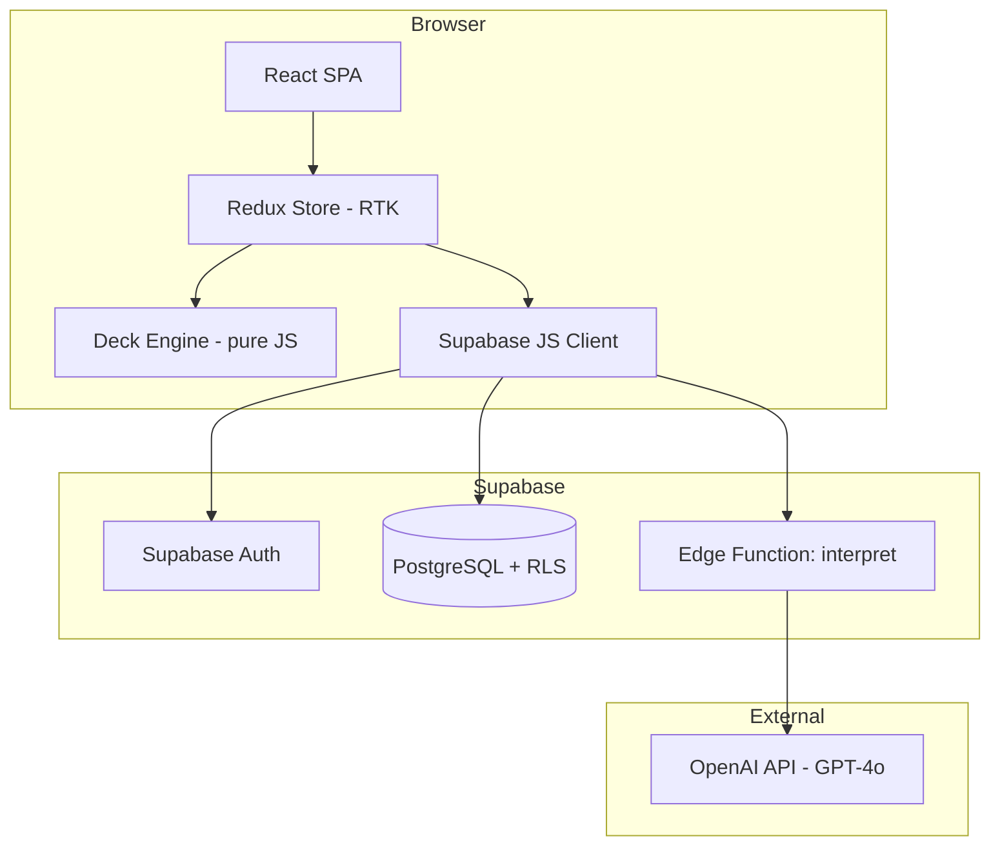
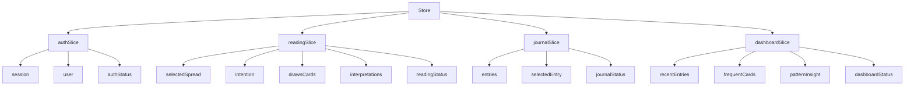
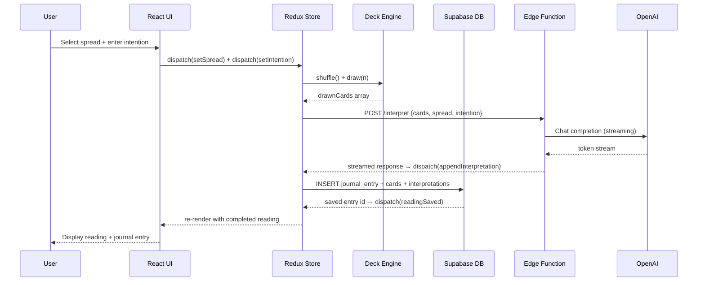

# Design Document: Tarot AI App

## Overview

The Tarot AI App is a web application that combines traditional tarot card reading with AI-generated interpretations and a private journaling system. Users authenticate, set an intention, select a spread, draw cards, receive personalized AI interpretations, and maintain a persistent journal of their readings over time.

The app is built as a React + JavaScript single-page application backed by Supabase (PostgreSQL + Auth + Row-Level Security) and the OpenAI API for interpretation generation. The frontend is served as a static site (Vite build) and communicates with Supabase directly from the browser for data operations, while AI calls are proxied through Supabase Edge Functions to keep the OpenAI API key server-side. Client-side state is managed with Redux Toolkit (RTK), providing a single predictable store for auth, reading, journal, and dashboard state.

### Key Design Decisions

- **Supabase for backend**: Provides auth, database, RLS-enforced data isolation, and Edge Functions in one managed platform — eliminating the need for a separate API server.
- **OpenAI GPT-4o for interpretations**: Produces coherent, contextually rich tarot interpretations. Prompts are structured to include card name, orientation, position meaning, and user intention.
- **Client-side card drawing**: The 78-card deck and shuffle/draw logic live entirely in the browser. No server round-trip is needed for randomization, keeping latency low.
- **Edge Functions as AI proxy**: The OpenAI key never reaches the client. Edge Functions validate the authenticated user's JWT before forwarding requests.
- **Streaming responses**: Interpretations stream token-by-token to the UI, eliminating the perception of a long wait and satisfying the loading-indicator requirement.
- **Redux Toolkit for state**: RTK slices manage auth, reading, journal, and dashboard state. Component local state is reserved only for ephemeral UI concerns (e.g., input focus). RTK Query is used for async data fetching from Supabase.

---

## Architecture



### Redux Store Shape



### Request Flow: New Reading



---

## Components and Interfaces

### Frontend Component Tree

```
App
├── AuthProvider (Supabase session → dispatches to authSlice)
├── Router
│   ├── /login → AuthPage
│   ├── /dashboard → DashboardPage
│   │   ├── RecentReadings (last 3, from dashboardSlice)
│   │   ├── FrequentCards (top 3, from dashboardSlice)
│   │   ├── PatternInsight (if ≥5 readings, from dashboardSlice)
│   │   └── StartReadingCTA
│   ├── /reading/new → NewReadingPage
│   │   ├── SpreadSelector (dispatches to readingSlice)
│   │   ├── IntentionInput (dispatches to readingSlice)
│   │   ├── CardDrawDisplay (reads from readingSlice)
│   │   └── InterpretationPanel (streaming, reads from readingSlice)
│   ├── /journal → JournalPage
│   │   ├── JournalList (reads from journalSlice)
│   │   └── PatternInsightBanner (reads from dashboardSlice)
│   └── /journal/:id → JournalEntryPage
│       ├── CardGrid
│       ├── InterpretationList
│       ├── JournalingPrompts
│       └── NotesEditor (dispatches to journalSlice)
```

### Redux Slices

#### `authSlice`

```js
// src/store/authSlice.js
import { createSlice, createAsyncThunk } from "@reduxjs/toolkit";

/**
 * @typedef {Object} AuthState
 * @property {Object|null} session - Supabase session object
 * @property {Object|null} user - Supabase user object
 * @property {'idle'|'loading'|'succeeded'|'failed'} status
 * @property {string|null} error
 */

const initialState = {
  session: null,
  user: null,
  status: "idle",
  error: null,
};

export const signIn = createAsyncThunk(
  "auth/signIn",
  async ({ email, password }, { rejectWithValue }) => {
    // calls supabase.auth.signInWithPassword(...)
  },
);

export const signUp = createAsyncThunk(
  "auth/signUp",
  async ({ email, password }, { rejectWithValue }) => {
    // calls supabase.auth.signUp(...)
  },
);

export const signOut = createAsyncThunk("auth/signOut", async () => {
  // calls supabase.auth.signOut()
});

const authSlice = createSlice({
  name: "auth",
  initialState,
  reducers: {
    setSession(state, action) {
      state.session = action.payload;
      state.user = action.payload?.user ?? null;
    },
    clearSession(state) {
      state.session = null;
      state.user = null;
    },
  },
  extraReducers: (builder) => {
    /* handle pending/fulfilled/rejected for signIn, signUp, signOut */
  },
});
```

#### `readingSlice`

```js
// src/store/readingSlice.js
import { createSlice, createAsyncThunk } from "@reduxjs/toolkit";

/**
 * @typedef {Object} ReadingState
 * @property {Object|null} selectedSpread - { id, name, description, positions[] }
 * @property {string} intention - user intention text (empty string = no intention)
 * @property {Array<DrawnCard>} drawnCards
 * @property {Array<{positionIndex: number, text: string}>} interpretations
 * @property {string|null} summaryInterpretation
 * @property {string[]} journalingPrompts
 * @property {'idle'|'drawing'|'interpreting'|'saving'|'done'|'error'} status
 * @property {string|null} error
 */

/**
 * @typedef {Object} DrawnCard
 * @property {TarotCard} card
 * @property {boolean} reversed
 * @property {SpreadPosition} position
 */

/**
 * @typedef {Object} TarotCard
 * @property {number} id - 0–77
 * @property {string} name
 * @property {'major'|'minor'} arcana
 * @property {'wands'|'cups'|'swords'|'pentacles'|undefined} suit
 * @property {string} imageDescription
 * @property {string[]} uprightKeywords
 * @property {string[]} reversedKeywords
 */

/**
 * @typedef {Object} SpreadPosition
 * @property {number} index
 * @property {string} label
 * @property {string} description
 */

export const fetchInterpretation = createAsyncThunk(
  "reading/fetchInterpretation",
  async (
    { spreadId, intention, drawnCards },
    { dispatch, rejectWithValue },
  ) => {
    // calls Supabase Edge Function /interpret with streaming
    // dispatches appendInterpretation for each streamed chunk
  },
);

export const saveReading = createAsyncThunk(
  "reading/saveReading",
  async (_, { getState, rejectWithValue }) => {
    // reads readingSlice state, writes to Supabase journal_entries + drawn_cards
  },
);

const readingSlice = createSlice({
  name: "reading",
  initialState,
  reducers: {
    setSpread(state, action) {
      state.selectedSpread = action.payload;
    },
    setIntention(state, action) {
      state.intention = action.payload;
    },
    setDrawnCards(state, action) {
      state.drawnCards = action.payload;
    },
    appendInterpretation(state, action) {
      /* append streamed chunk */
    },
    resetReading() {
      return initialState;
    },
  },
  extraReducers: (builder) => {
    /* handle fetchInterpretation, saveReading lifecycle */
  },
});
```

#### `journalSlice`

```js
// src/store/journalSlice.js
import { createSlice, createAsyncThunk } from "@reduxjs/toolkit";

/**
 * @typedef {Object} JournalState
 * @property {JournalEntry[]} entries
 * @property {JournalEntry|null} selectedEntry
 * @property {'idle'|'loading'|'succeeded'|'failed'} status
 * @property {string|null} error
 */

/**
 * @typedef {Object} JournalEntry
 * @property {string} id
 * @property {string} userId
 * @property {Object} reading
 * @property {Array<{positionIndex: number, text: string, reversed: boolean}>} interpretations
 * @property {string} summaryInterpretation
 * @property {string[]} journalingPrompts
 * @property {string|null} userNotes
 * @property {Object.<number, string>} promptResponses - prompt index → response text
 * @property {string} createdAt - ISO timestamp
 * @property {string} updatedAt - ISO timestamp
 */

export const fetchJournalEntries = createAsyncThunk(
  "journal/fetchEntries",
  async (_, { rejectWithValue }) => {
    // queries Supabase journal_entries ordered by created_at DESC
  },
);

export const fetchJournalEntry = createAsyncThunk(
  "journal/fetchEntry",
  async (id, { rejectWithValue }) => {
    // queries single journal entry with drawn_cards join
  },
);

export const updateNotes = createAsyncThunk(
  "journal/updateNotes",
  async ({ id, notes }, { rejectWithValue }) => {
    // updates user_notes on journal_entries
  },
);

export const savePromptResponse = createAsyncThunk(
  "journal/savePromptResponse",
  async ({ id, promptIndex, response }, { rejectWithValue }) => {
    // merges into prompt_responses JSONB column
  },
);

export const deleteJournalEntry = createAsyncThunk(
  "journal/deleteEntry",
  async (id, { rejectWithValue }) => {
    // deletes from journal_entries (cascade removes drawn_cards)
  },
);

const journalSlice = createSlice({
  name: "journal",
  initialState,
  reducers: {
    selectEntry(state, action) {
      state.selectedEntry = action.payload;
    },
  },
  extraReducers: (builder) => {
    /* handle all async thunks */
  },
});
```

#### `dashboardSlice`

```js
// src/store/dashboardSlice.js
import { createSlice, createAsyncThunk } from "@reduxjs/toolkit";

/**
 * @typedef {Object} DashboardState
 * @property {JournalEntrySummary[]} recentEntries - last 3
 * @property {FrequentCard[]} frequentCards - top 3
 * @property {string|null} patternInsight - null if <5 readings
 * @property {number} totalReadings
 * @property {'idle'|'loading'|'succeeded'|'failed'} status
 * @property {string|null} error
 */

/**
 * @typedef {Object} FrequentCard
 * @property {TarotCard} card
 * @property {number} count
 */

/**
 * @typedef {Object} JournalEntrySummary
 * @property {string} id
 * @property {string} spreadName
 * @property {string|null} intention
 * @property {string} createdAt - ISO timestamp
 */

export const fetchDashboard = createAsyncThunk(
  "dashboard/fetch",
  async (_, { rejectWithValue }) => {
    // queries recent entries, aggregates card frequencies, fetches latest pattern insight
  },
);

const dashboardSlice = createSlice({
  name: "dashboard",
  initialState,
  reducers: {},
  extraReducers: (builder) => {
    /* handle fetchDashboard lifecycle */
  },
});
```

### Store Configuration

```js
// src/store/index.js
import { configureStore } from "@reduxjs/toolkit";
import authReducer from "./authSlice.js";
import readingReducer from "./readingSlice.js";
import journalReducer from "./journalSlice.js";
import dashboardReducer from "./dashboardSlice.js";

export const store = configureStore({
  reducer: {
    auth: authReducer,
    reading: readingReducer,
    journal: journalReducer,
    dashboard: dashboardReducer,
  },
});
```

### Deck Engine API

Pure functions with no side effects — fully testable without mocking:

```js
// src/engine/deck.js

/**
 * Creates a full 78-card tarot deck.
 * @returns {TarotCard[]}
 */
export function createDeck() {
  /* ... */
}

/**
 * Returns a new shuffled copy of the deck (Fisher-Yates).
 * @param {TarotCard[]} deck
 * @returns {TarotCard[]}
 */
export function shuffle(deck) {
  /* ... */
}

/**
 * Draws `count` cards from a shuffled deck, each with a random reversed orientation.
 * @param {TarotCard[]} shuffledDeck
 * @param {number} count
 * @param {SpreadPosition[]} positions
 * @returns {DrawnCard[]}
 */
export function draw(shuffledDeck, count, positions) {
  /* ... */
}

/**
 * Assigns a reversed orientation to a card with 50% probability.
 * @param {TarotCard} card
 * @returns {boolean}
 */
export function assignReversed(card) {
  /* ... */
}
```

### Edge Function: `/interpret`

**Input (plain JS object sent as JSON):**

```js
// InterpretRequest shape
{
  spreadId: string,
  intention: string | null,
  drawnCards: [
    {
      cardName: string,
      reversed: boolean,
      positionLabel: string,
      positionDescription: string,
    }
  ],
  previousInterpretationIds: string[], // optional, for distinctness enforcement
}
```

**Output (streamed JSON lines):**

```js
// InterpretResponse shape
{
  cardInterpretations: [{ positionIndex: number, text: string }],
  summaryInterpretation: string,
  journalingPrompts: string[], // exactly 3
}
```

---

## Data Models

### Database Schema (PostgreSQL via Supabase)

```sql
-- Users managed by Supabase Auth (auth.users)

CREATE TABLE spreads (
  id          TEXT PRIMARY KEY,          -- 'single', 'three-card', 'celtic-cross'
  name        TEXT NOT NULL,
  description TEXT NOT NULL,
  position_count INT NOT NULL
);

CREATE TABLE journal_entries (
  id              UUID PRIMARY KEY DEFAULT gen_random_uuid(),
  user_id         UUID NOT NULL REFERENCES auth.users(id) ON DELETE CASCADE,
  spread_id       TEXT NOT NULL REFERENCES spreads(id),
  intention       TEXT,                  -- nullable, max 500 chars
  summary_interpretation TEXT,
  journaling_prompts JSONB,              -- string[]
  user_notes      TEXT,
  prompt_responses JSONB,               -- { [promptIndex]: responseText }
  created_at      TIMESTAMPTZ NOT NULL DEFAULT now(),
  updated_at      TIMESTAMPTZ NOT NULL DEFAULT now()
);

CREATE TABLE drawn_cards (
  id              UUID PRIMARY KEY DEFAULT gen_random_uuid(),
  journal_entry_id UUID NOT NULL REFERENCES journal_entries(id) ON DELETE CASCADE,
  card_id         INT NOT NULL,          -- 0–77, references static deck data
  position_index  INT NOT NULL,
  reversed        BOOLEAN NOT NULL,
  interpretation  TEXT NOT NULL,
  created_at      TIMESTAMPTZ NOT NULL DEFAULT now()
);

CREATE TABLE pattern_insights (
  id              UUID PRIMARY KEY DEFAULT gen_random_uuid(),
  user_id         UUID NOT NULL REFERENCES auth.users(id) ON DELETE CASCADE,
  insight_text    TEXT NOT NULL,
  generated_at    TIMESTAMPTZ NOT NULL DEFAULT now(),
  month           DATE NOT NULL          -- first day of the month
);

-- Row-Level Security
ALTER TABLE journal_entries ENABLE ROW LEVEL SECURITY;
ALTER TABLE drawn_cards ENABLE ROW LEVEL SECURITY;
ALTER TABLE pattern_insights ENABLE ROW LEVEL SECURITY;

CREATE POLICY "users_own_entries" ON journal_entries
  USING (user_id = auth.uid());

CREATE POLICY "users_own_drawn_cards" ON drawn_cards
  USING (
    journal_entry_id IN (
      SELECT id FROM journal_entries WHERE user_id = auth.uid()
    )
  );

CREATE POLICY "users_own_insights" ON pattern_insights
  USING (user_id = auth.uid());
```

### Static Deck Data

The 78-card deck is stored as a plain JavaScript module (`src/data/deck.js`) — an array of card objects documented with JSDoc. This avoids a database round-trip on every reading and keeps the deck immutable and version-controlled.

### Indexes

```sql
CREATE INDEX idx_journal_entries_user_created
  ON journal_entries(user_id, created_at DESC);

CREATE INDEX idx_drawn_cards_entry
  ON drawn_cards(journal_entry_id);

CREATE INDEX idx_drawn_cards_user_card
  ON drawn_cards(journal_entry_id, card_id);
```

---

## Correctness Properties

_A property is a characteristic or behavior that should hold true across all valid executions of a system — essentially, a formal statement about what the system should do. Properties serve as the bridge between human-readable specifications and machine-verifiable correctness guarantees._

### Property 1: Deck integrity

_For any_ call to `createDeck()`, the resulting array SHALL contain exactly 78 cards, with exactly 22 Major Arcana and 56 Minor Arcana, no duplicate card ids, and every card having non-empty name, arcana type, imageDescription, uprightKeywords, and reversedKeywords fields.

**Validates: Requirements 2.1, 2.2**

---

### Property 2: Shuffle is a permutation

_For any_ deck, `shuffle(deck)` SHALL return an array containing exactly the same cards as the input (same ids, same count) with no additions or omissions.

**Validates: Requirements 2.3**

---

### Property 3: Reversed orientation distribution

_For any_ large sample of drawn cards (≥ 1000 independent draws), the proportion of reversed cards SHALL converge to 0.5 ± 0.05.

**Validates: Requirements 2.4**

---

### Property 4: Draw count matches spread

_For any_ spread with N positions, calling `draw(shuffledDeck, N, positions)` SHALL return exactly N drawn cards with no repeated card ids.

**Validates: Requirements 2.3, 3.3**

---

### Property 5: Auth round-trip

_For any_ valid email and password of at least 8 characters, registering an account and then logging in with those same credentials SHALL return an authenticated session, and the Redux `authSlice` SHALL reflect a non-null session and user.

**Validates: Requirements 1.2, 1.4**

---

### Property 6: Auth error conditions

_For any_ email already registered in the system, attempting to register again SHALL return a duplicate-email error and the `authSlice` status SHALL be `'failed'`. _For any_ credential pair that does not match a registered account, attempting to log in SHALL return an authentication error and SHALL NOT set a session in the store.

**Validates: Requirements 1.3, 1.5**

---

### Property 7: AI prompt construction includes all required fields

_For any_ set of drawn cards with orientations, spread positions, and an intention (including null), the prompt constructed for the AI engine SHALL include each card's name, its orientation (upright or reversed), its position label and description, and the intention value (or a general-reading instruction when intention is null).

**Validates: Requirements 4.2, 4.3, 5.1**

---

### Property 8: Interpretation word count

_For any_ card interpretation text returned by the AI engine (or its mock), the word count SHALL be between 100 and 400 words inclusive.

**Validates: Requirements 5.2**

---

### Property 9: AI response structure

_For any_ completed reading, the AI response SHALL include a non-empty `summaryInterpretation` field and exactly 3 `journalingPrompts` strings, and these SHALL be reflected in the `readingSlice` state.

**Validates: Requirements 5.5, 8.1**

---

### Property 10: Journal entry round-trip

_For any_ completed reading (spread, drawn cards with orientations, interpretations, intention), saving it as a journal entry and then retrieving it SHALL produce a record with identical spread id, card ids, card orientations, interpretation texts, and intention value — and the `journalSlice` entries array SHALL contain the saved entry.

**Validates: Requirements 4.4, 6.1, 6.3**

---

### Property 11: Journal chronological ordering

_For any_ set of journal entries belonging to a user, the list returned by the journal query SHALL be ordered by `created_at` descending (most recent first), and the `journalSlice.entries` array SHALL reflect this ordering.

**Validates: Requirements 6.2**

---

### Property 12: Card frequency counts and top-3 display

_For any_ user's reading history, the frequency count for each card SHALL equal the number of times that card id appears across all `drawn_cards` rows for that user, and the top-3 cards in `dashboardSlice.frequentCards` SHALL be the three cards with the highest frequency counts.

**Validates: Requirements 7.1, 7.2, 10.5**

---

### Property 13: Journal entry summary fields

_For any_ journal entry in the list view or dashboard recent-entries panel, the rendered summary SHALL include the entry's date, spread name, and intention (or an empty-intention indicator when intention is null).

**Validates: Requirements 7.4, 10.2**

---

### Property 14: Prompt response round-trip

_For any_ user response to a journaling prompt, saving the response and then retrieving the journal entry SHALL return the same response text at the same prompt index, and the `journalSlice.selectedEntry.promptResponses` SHALL reflect the saved value.

**Validates: Requirements 8.4**

---

### Property 15: User data isolation

_For any_ two distinct authenticated users A and B, all database queries executed in the context of user A's session SHALL return zero rows belonging to user B.

**Validates: Requirements 9.3**

---

### Property 16: Card alt text present

_For any_ tarot card rendered in the UI, the card image element SHALL have a non-empty `alt` attribute containing the card's name and imagery description.

**Validates: Requirements 11.3**

---

### Property 17: Whitespace intention treated as absent

_For any_ intention string composed entirely of whitespace characters (spaces, tabs, newlines), the system SHALL treat it equivalently to a null intention — the AI prompt SHALL use the general-reading instruction rather than including the whitespace string as an intention, and `readingSlice.intention` SHALL be normalized to an empty string before dispatch.

**Validates: Requirements 4.1, 4.3**

---

## Error Handling

| Scenario                        | Behavior                                                                                                        |
| ------------------------------- | --------------------------------------------------------------------------------------------------------------- |
| OpenAI API timeout (>30s)       | `readingSlice.status` → `'error'`; display error message; offer retry button; do not save partial entry         |
| OpenAI API error (non-timeout)  | Same as timeout; log error server-side in Edge Function                                                         |
| Supabase write failure          | Show toast error; reading data remains in `readingSlice` so user can retry save                                 |
| Auth session expired            | Redirect to login; preserve intended destination for post-login redirect; dispatch `clearSession`               |
| Duplicate email on registration | `authSlice.status` → `'failed'`; display inline field error: "An account with this email already exists"        |
| Invalid credentials on login    | `authSlice.status` → `'failed'`; display generic error: "Incorrect email or password" (no enumeration)          |
| Account deletion                | Cascade delete via `ON DELETE CASCADE`; schedule data purge job within 30 days                                  |
| Reduced-motion preference       | `prefers-reduced-motion` media query disables card flip/shuffle animations                                      |
| Network offline                 | Show offline banner; disable new reading action; `readingSlice.status` remains `'idle'`                         |
| Intention > 500 characters      | Input field enforces maxLength=500; excess characters are not accepted; `readingSlice.intention` is not updated |

---

## Testing Strategy

### Unit Tests (Vitest)

Focus on pure functions and Redux slice reducers:

- `createDeck()` — verify 78 cards, correct arcana split, no duplicates, all fields present
- `shuffle(deck)` — verify output length, all original cards present
- `draw(deck, n, positions)` — verify count, no repeated cards in a single draw
- Intention validation — whitespace trimming, 500-char limit enforcement
- `readingSlice` reducers — `setSpread`, `setIntention`, `setDrawnCards`, `appendInterpretation`, `resetReading`
- `journalSlice` reducers — `selectEntry`, optimistic update on `updateNotes`
- `dashboardSlice` — `fetchDashboard` fulfilled/rejected state transitions
- Dashboard aggregation helpers — `getFrequentCards()`, `getRecentEntries()` with known seed data
- Interpretation word-count validation helper

### Property-Based Tests (fast-check, minimum 100 iterations each)

Each property test is tagged with a comment referencing the design document property:

```
// Feature: tarot-ai-app, Property 1: Deck integrity
// Feature: tarot-ai-app, Property 2: Shuffle is a permutation
// Feature: tarot-ai-app, Property 3: Reversed orientation distribution
// Feature: tarot-ai-app, Property 4: Draw count matches spread
// Feature: tarot-ai-app, Property 5: Auth round-trip
// Feature: tarot-ai-app, Property 6: Auth error conditions
// Feature: tarot-ai-app, Property 7: AI prompt construction includes all required fields
// Feature: tarot-ai-app, Property 8: Interpretation word count
// Feature: tarot-ai-app, Property 9: AI response structure
// Feature: tarot-ai-app, Property 10: Journal entry round-trip
// Feature: tarot-ai-app, Property 11: Journal chronological ordering
// Feature: tarot-ai-app, Property 12: Card frequency counts and top-3 display
// Feature: tarot-ai-app, Property 13: Journal entry summary fields
// Feature: tarot-ai-app, Property 14: Prompt response round-trip
// Feature: tarot-ai-app, Property 15: User data isolation
// Feature: tarot-ai-app, Property 16: Card alt text present
// Feature: tarot-ai-app, Property 17: Whitespace intention treated as absent
```

- Properties 1–4 and 17 test pure JavaScript functions (deck engine, validation) — no mocking needed.
- Properties 5–6 test the auth layer using Supabase local emulator; verify Redux `authSlice` state transitions.
- Properties 7–9 test prompt construction and AI response parsing with a mocked OpenAI client; verify `readingSlice` state.
- Properties 10–14 test the journal persistence layer using Supabase local emulator or in-memory mock; verify `journalSlice` state.
- Property 15 tests RLS policies using two distinct Supabase test users.
- Property 16 tests React component rendering with generated card data.

### Integration Tests

- Full auth flow: register → login → logout → login again; verify `authSlice` transitions throughout
- Full reading flow: spread selection → card draw → AI interpretation (mocked Edge Function) → journal save → retrieve; verify `readingSlice` and `journalSlice` state at each step
- Dashboard data: verify correct counts and ordering after seeding known reading history; verify `dashboardSlice` state
- Account deletion: verify cascade removes all user data
- Pattern insight trigger: seed 5 readings, verify insight generation is triggered

### Snapshot / Visual Tests

- Card component renders name and image description
- Spread layout renders correct number of position slots
- Dashboard renders empty state when no journal entries exist
- Dashboard renders recent entries, frequent cards, and pattern insight when data exists
- Dark/light mode renders without layout breakage at 320px, 768px, 1280px, and 2560px widths
